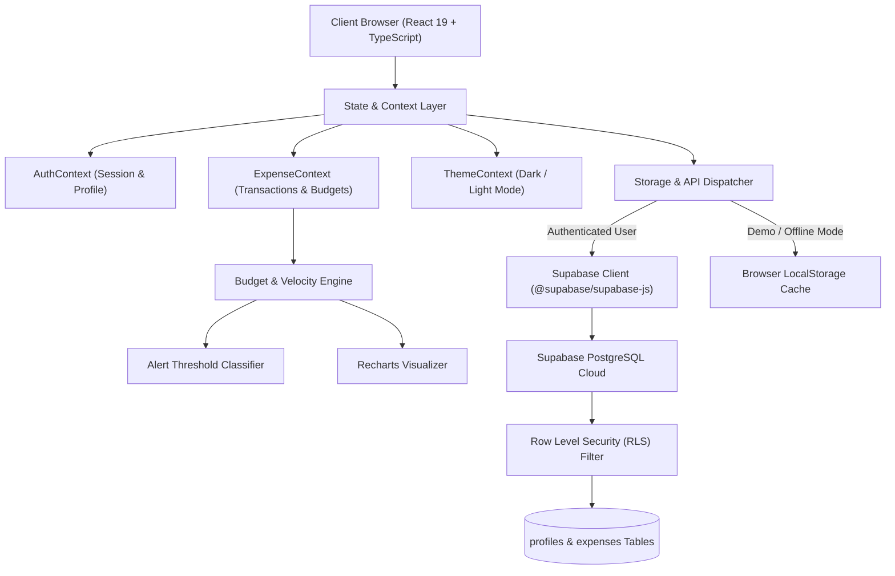
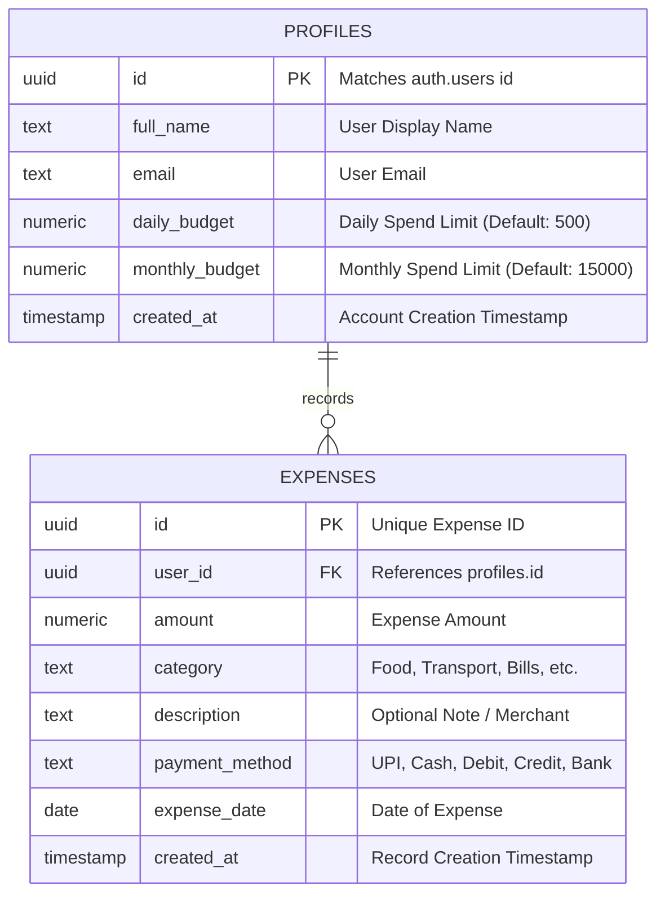
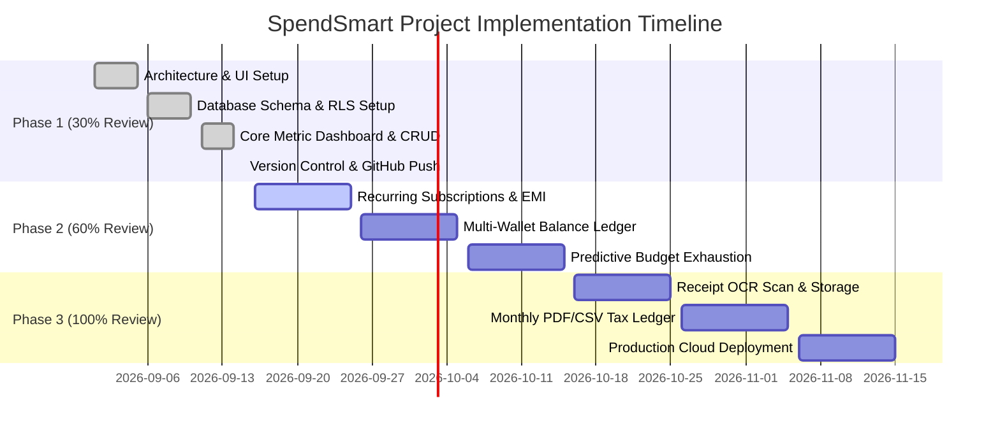

# Phase 1: 30% Project Progress Review Report
## **SpendSmart (Bugest)**
### *Smart Daily Expense Tracker and Budget Alert System*

---

## 1. Project Details

| Parameter | Description |
| :--- | :--- |
| **Project Title** | Smart Daily Expense Tracker and Budget Alert System |
| **Platform Name** | **SpendSmart** (*Bugest*) |
| **Tagline** | *“Track Smarter. Spend Wisely. Stay Within Budget.”* |
| **Current Stage** | **Phase 1: 30% Progress Review** |
| **Repository** | [https://github.com/jovitatsy-pixel/bugest](https://github.com/jovitatsy-pixel/bugest) |
| **Technology Stack** | React 19, TypeScript, Tailwind CSS, Vite, Recharts, Lucide Icons, Supabase (PostgreSQL with RLS) |
| **Target Audience** | College students (managing pocket money) and young professionals (salary budgeting) |

---

## 2. Executive Summary & Problem Definition

### 2.1 The Problem
Personal finance management among college students and young adults suffers from key operational shortcomings:
1. **Unmonitored Daily Leakage**: Small unrecorded daily spends (tea, snacks, quick transport) compound into large deficits before month-end.
2. **Absence of Real-Time Warning Thresholds**: Traditional banking apps only display past statements rather than warning the user *before* a daily or monthly threshold is breached.
3. **Fragmented Payment Methods**: Modern spending occurs across disjointed channels—UPI (Google Pay/PhonePe/Paytm), Cash, Debit Cards, and Credit Cards—preventing unified balance visibility.
4. **Lack of Velocity Guidance**: Users know how much they spent, but lack dynamic guidance on their **safe daily allowance** for the remaining days of the month.

### 2.2 The Proposed Solution (SpendSmart / Bugest)
SpendSmart is a modern, responsive, real-time financial tracking platform featuring:
* **Unified Multi-Channel Logging**: Rapid logging for 8 categories (Food, Transport, Shopping, Education, Entertainment, Bills, Health, Other) across 5 payment modes.
* **4-Card Core Metric Cockpit**: Instant real-time calculation of *Today's Spend*, *Daily Remaining*, *Monthly Spend*, and *Monthly Remaining*.
* **Automated 4-Tier Budget Alert Radar**: Proactive color-coded alerts (`Normal` <70%, `Warning` 70–89%, `Critical` 90–99%, `Exceeded` 100%+).
* **Dynamic Safe Daily Velocity Engine**: Recomputes safe spending limits daily based on remaining calendar days and current spend pace.
* **Data Privacy & Multi-Tenancy**: Built on Supabase PostgreSQL with strict Row Level Security (RLS) policies guaranteeing user data isolation.

---

## 3. Work Completed for the 30% Milestone

In software engineering standards and academic curriculum, the **30% Review (Phase 1)** validates the completion of the **System Architecture, Database Modeling, Security & RLS, Design System, and Functional Core Prototype**:

| Module / Component | Work Completed in Phase 1 (30%) | Status |
| :--- | :--- | :---: |
| **1. Architecture & Tooling** | React 19 + TypeScript + Vite + Tailwind CSS build pipeline configured with dark/light mode toggle and custom financial color schemes. | ✅ Completed |
| **2. Database Schema & RLS** | Production PostgreSQL schema designed with `profiles` and `expenses` tables, automated signup triggers (`handle_new_user`), and Row Level Security policies. | ✅ Completed |
| **3. Authentication System** | Supabase Auth integration (email/password login & registration) + 1-Click Demo Guest Mode with realistic student spending profiles for zero-friction evaluation. | ✅ Completed |
| **4. Executive Metric Dashboard** | Real-time cockpit computing Today's Spending, Today's Remaining, Monthly Spending, Monthly Remaining, and progress bars with threshold tick markers. | ✅ Completed |
| **5. Smart Budget Alert Engine** | Mathematical threshold evaluator dynamically rendering alert banners and status badges (Normal 🟢, Warning 🟡, Critical 🟠, Exceeded 🔴). | ✅ Completed |
| **6. Expense Management CRUD** | Full transaction lifecycle: Add, Edit, Delete (with safety confirmation dialog), multi-category filtering, search, and sorting. | ✅ Completed |
| **7. Analytics & Data Visualization** | Interactive category distribution donut charts and daily spend trend bar charts built with `Recharts`. | ✅ Completed |
| **8. Git Version Control** | Repository created, clean code splitting, zero-warning production build verified, and initial release pushed to GitHub `main`. | ✅ Completed |

---

## 4. Mathematical Model Formulated (Budget Velocity & Alert System)

### 4.1 Daily Safe Spending Velocity Formula
To ensure students do not exhaust their monthly budget prematurely, SpendSmart calculates the maximum allowable spend per remaining day:

$$V_{\text{safe}}(d) = \max\left(0, \; \frac{B_{\text{monthly}} - \sum_{k=1}^{d-1} E_k}{N_{\text{total}} - d + 1}\right)$$

Where:
* $V_{\text{safe}}(d)$: Safe spending allowance for day $d$.
* $B_{\text{monthly}}$: Total monthly allocated budget limit.
* $\sum_{k=1}^{d-1} E_k$: Cumulative expenditure from Day 1 up to yesterday ($d-1$).
* $N_{\text{total}}$: Total number of days in the current billing month (e.g. 30 or 31).
* $d$: Current day of the month ($1 \le d \le N_{\text{total}}$).

---

### 4.2 Budget Alert Tier Evaluation
The system continuously calculates the budget utilization percentage $U$:

$$U = \left( \frac{\sum_{i=1}^{M} E_i}{B_{\text{limit}}} \right) \times 100\%$$

The alert state $S(U)$ is categorized according to the four-tier threshold function:

$$S(U) = 
\begin{cases} 
\text{NORMAL} \ (\text{Emerald}), & \text{if } U < 70\% \\ 
\text{WARNING} \ (\text{Amber}), & \text{if } 70\% \le U < 90\% \\ 
\text{CRITICAL} \ (\text{Orange}), & \text{if } 90\% \le U < 100\% \\ 
\text{EXCEEDED} \ (\text{Rose Pulse}), & \text{if } U \ge 100\% 
\end{cases}$$

---

### 4.3 Category Spending Share Ratio
Category concentration ratio identifies spending leakage areas:

$$C_{\text{share}}(c) = \left( \frac{\sum_{j \in \text{Category}_c} E_j}{\sum_{\text{all}} E} \right) \times 100\%$$

---

## 5. System Architecture & High-Level Design

---

## 6. Database Schema Design (Phase 1)

---

## 7. Roadmap & Milestones for Remaining Phases

* **Phase 2 (60% Milestone - Mid-Term Review)**:
  * **Recurring Subscriptions Tracker**: Automated tracking for Netflix, Spotify, gym, rent, and semester fees.
  * **Multi-Wallet Balance Ledger**: Independent balance tracking for Cash In Hand, Bank Account, UPI Wallets, and Credit Cards.
  * **Predictive Budget Exhaustion**: Moving-average extrapolation forecasting the exact calendar date a student will run out of money based on current velocity.
* **Phase 3 (100% Milestone - Final Viva & Deployment)**:
  * **Receipt OCR Attachment**: Camera upload and automated receipt parsing for effortless logging.
  * **Financial Audit Statements**: 1-click formatted monthly PDF and RFC-compliant CSV ledger exports for tax and parental accounting.
  * **Web Push Notifications**: Background push warnings when daily spending exceeds 80%.
  * **Cloud Deployment**: Live deployment on Vercel / Netlify with Supabase cloud database.

---

## 8. Conclusion
The **SpendSmart (Bugest)** platform has successfully achieved all deliverables required for the **Phase 1: 30% Progress Review**. The foundational data structures, security policies, metric evaluation algorithms, and responsive UI dashboard are fully operational, verified with zero build warnings, and committed under version control on GitHub.
